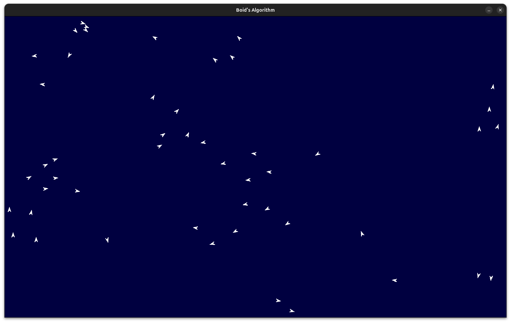

# Boid's Algorithm: #

### The Code: ###
This was a weekend project for me to learn how to use PyGame, and play around with something I've wanted to try for a while - Boid's algorithm. For those unfamiliar with it, Boid's algorithm is an algorithm designed to show emergent behaviour. Each 'boid' adjusts its heading vector (speed is kept constant) based on three rules: Cohesion, Alignment, and Separation. If there are no other boids close by, the boid's heading vector will be adjusted by a slight random amount. When a boid collides with an edge of the simulation window, it simply bounces off (reflection angle = incidence angle).

Cohesion: Each boid will steer towards the centre of mass of the local boids (boids within a certain viewrange of itself)\
Alignment: Each boid will adjust its heading vector towards the mean heading vector of the local boids\
Separation: Boids will steer to avoid getting too close to each other

The result is similar to how flocks of birds (or other animals, such as fish) behave - and has been used in computer graphics to provide realistic bird flocks.

### Using it: ###
The algorithm works out of the box (provided you have python3 and pygame already installed)

There are various parameters in this code you can tweak:
 - WIDTH: The width of the simulation window, in pixels
 - HEIGHT: The height of the simulation window, in pixels
 - BACKGROUND_COLOUR: RGB code for the background screen colour
 - BOID_COLOUR: RGB code for the boid's colour
 - NUM_BOIDS: The number of boids simulated
 - BOID_VIEWRANGE_PX: The maximum range at which a boid will be classed as a 'local boid', and included in the cohesion/alignment/separation calculations. In pixels.
 - VELOCITY: The number of pixels a boid will move per frame (fps=24)\
 
 - ALIGN_WEIGHT: The weighting of the vector from the alignment calculations
 - COHESION_WEIGHT: The weighting of the vector from the cohesion calculations
 - SEPARATION_WEIGHT: The weighting of the vector from the separation calculations
 - SMOOTHING_WEIGHT: The weight in the exponential smoothing algorithm used to smooth out the boid's new calculated heading vector

### References: ###
 - <https://en.wikipedia.org/wiki/Boids>
 - <https://www.geeksforgeeks.org/python/pygame-tutorial/>
 - <https://www.pygame.org/docs/>